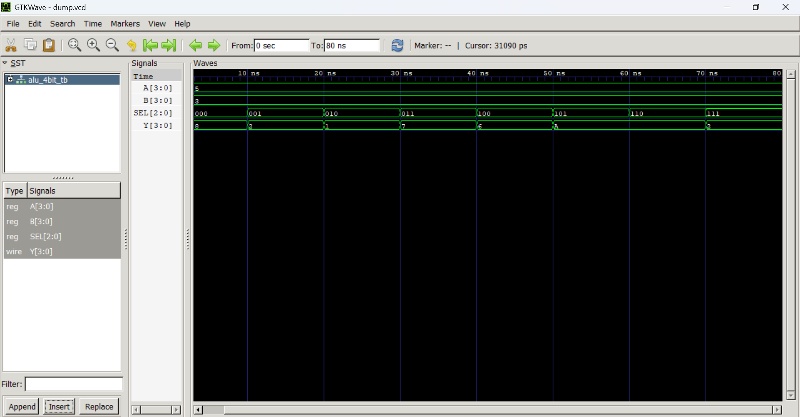

# 4-bit ALU using Verilog HDL

## Overview
This project implements a 4-bit Arithmetic Logic Unit (ALU) using Verilog HDL.  
The ALU performs arithmetic and logical operations based on the select input (`SEL`).

---

## Features
- 4-bit input operands
- Arithmetic operations
  - Addition
  - Subtraction
- Logical operations
  - AND
  - OR
  - XOR
  - NOT
- Shift operations
  - Left Shift
  - Right Shift
- Verilog Testbench for simulation
- GTKWave waveform verification

---

## Operations Table

| SEL | Operation |
|-----|------------|
| 000 | A + B |
| 001 | A - B |
| 010 | A AND B |
| 011 | A OR B |
| 100 | A XOR B |
| 101 | NOT A |
| 110 | Left Shift |
| 111 | Right Shift |

---

## Tools Used
- Verilog HDL
- Icarus Verilog
- GTKWave
- Visual Studio Code

---

## Project Structure

```text
4bit_ALU/
│
├── 4bit_alu.v
├── 4bit_alu_tb.v
├── dump.vcd
└── README.md
```

---

## Simulation Commands

Compile the design:

```bash
iverilog -o 4bit_alu_tb.vvp 4bit_alu.v 4bit_alu_tb.v
```

Run simulation:

```bash
vvp 4bit_alu_tb.vvp
```

Open waveform:

```bash
gtkwave dump.vcd
```

---

## Sample Simulation Output

```text
Time=0     A=0101 B=0011 SEL=000 Y=1000
Time=10000 A=0101 B=0011 SEL=001 Y=0010
Time=20000 A=0101 B=0011 SEL=010 Y=0001
Time=30000 A=0101 B=0011 SEL=011 Y=0111
Time=40000 A=0101 B=0011 SEL=100 Y=0110
```

---

## Waveform Output



## Block Diagram & Truth Table


## Learning Outcomes
- Understanding combinational circuit design
- Writing Verilog RTL code
- Developing testbenches
- Simulation using Icarus Verilog
- Waveform analysis using GTKWave
- GitHub project management

---

## Author
Pavan Kumar G V

GitHub: https://github.com/Pavanagv
